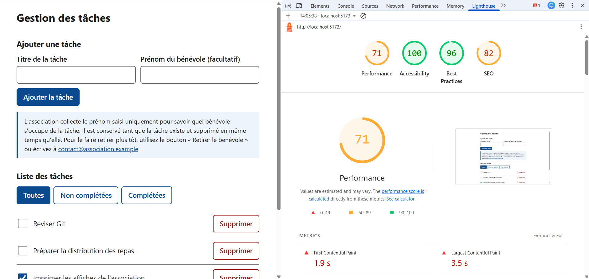
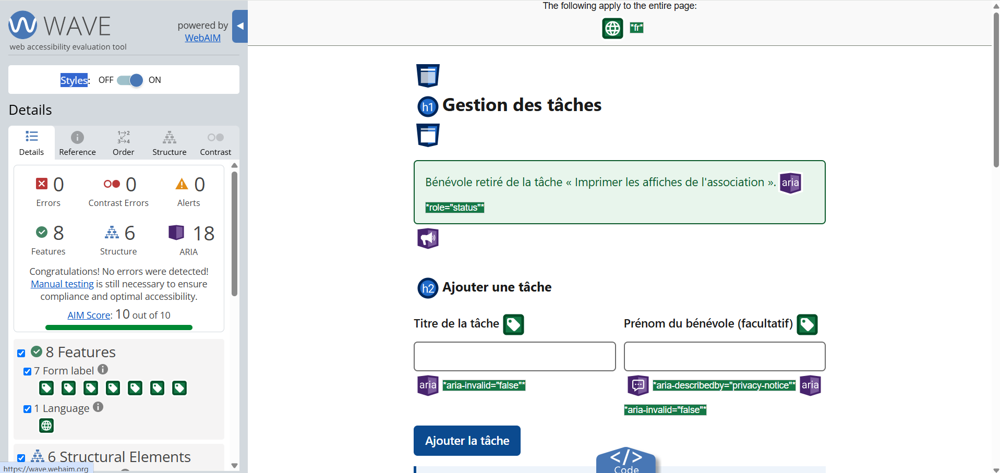

# TP 5 – Gestion de tâches : interface React accessible, sécurisée et conforme au RGPD

Application de gestion de tâches pour une association de bénévoles, dont certains sont malvoyants.

- **API** : Node.js (Express 5), PostgreSQL, Joi, Docker Compose (à la racine)
- **Interface** : React + Vite (dans `frontend/`)

## Lancer le projet

Prérequis : Docker Desktop, Node.js 20 ou plus.

### 1. Créer les fichiers `.env` (jamais commités)

```bash
cp .env.example .env
cp frontend/.env.example frontend/.env
```

Sous PowerShell : `Copy-Item .env.example .env` puis `Copy-Item frontend/.env.example frontend/.env`.

Ouvrir ensuite `.env` à la racine et choisir un vrai nom d'utilisateur et un vrai mot de passe pour la base. Dans `frontend/.env`, seule l'URL de l'API est présente.

### 2. Démarrer l'API et la base

```bash
docker compose up -d --build
```

L'API répond sur http://localhost:3001/tasks (le port interne 3000 est publié sur 3001).

### 3. Démarrer l'interface

```bash
cd frontend
npm install
npm run dev
```

L'application tourne sur http://localhost:5173.

### Autres commandes

```bash
npm run lint                  # dans frontend : ESLint + eslint-plugin-jsx-a11y
docker compose logs api       # logs de l'API (ils ne contiennent aucun contenu de requête)
docker compose down -v        # arrête tout ET supprime la base (à faire après avoir
                              # modifié les identifiants ou init.sql)
```

> PostgreSQL ne lit les identifiants et `db-init/init.sql` qu'à la création de la base.
> Après les avoir modifiés : `docker compose down -v` puis `docker compose up -d --build`.

## Routes de l'API

| Méthode | Route | Rôle |
|---|---|---|
| GET | `/tasks` | Liste des tâches (`?status=completed` ou `?status=pending`) |
| GET | `/tasks/:id` | Une tâche |
| POST | `/tasks` | Crée une tâche (`title` obligatoire, `assignee` facultatif) |
| PUT | `/tasks/:id` | Modifie `title`, `completed` et/ou `assignee` |
| PATCH | `/tasks/:id/completed` | Inverse l'état complété / non complété |
| DELETE | `/tasks/:id/assignee` | Efface le prénom du bénévole (la tâche est conservée) |
| DELETE | `/tasks/:id` | Supprime la tâche (et donc son prénom) |

## Accessibilité

Mesures mises en place : `lang="fr"` et titre de page, un seul `<h1>`, `<header>` et `<main>`, liste en `<ul>`/`<li>`, chaque champ avec un `<label>` visible, vrais `<button>` avec un nom explicite (`aria-label`), statut d'une tâche par une case à cocher, focus clavier toujours visible, messages de succès en `role="status"` et d'erreur en `role="alert"`, erreur de saisie reliée au champ par `aria-describedby`, contrastes d'au moins 4,5:1 (thèmes clair et sombre, selon la préférence du système), lien d'évitement « Aller au contenu principal », polices système (aucune police externe).

### Lighthouse



### WAVE



## Performance

Aucune police, image ni bibliothèque externe : uniquement du CSS (environ 7 Ko) et React. Mesures : `scrollbar-gutter` pour éviter les décalages de page, `content-visibility` sur les lignes de la liste, transitions limitées aux couleurs et désactivées si l'utilisateur le demande (`prefers-reduced-motion`).

Pour mesurer avec Lighthouse, utiliser la version de production plutôt que `npm run dev` :

```bash
cd frontend
npm run build
npm run preview
```

## Sécurité

- **Secrets hors du code** : identifiants PostgreSQL dans `.env` (ignoré par Git), lus par Docker Compose. Seuls les `.env.example` (valeurs fictives) sont commités.
- **Aucun secret dans le frontend** : seule `VITE_API_URL` y figure.
- **CORS** : l'API n'accepte que l'origine du frontend (`CORS_ORIGIN`, par défaut `http://localhost:5173`), jamais `*`.
- **Validation** : Joi côté API (titre obligatoire de 255 caractères au plus, prénom de 50 caractères au plus, lettres uniquement), en plus des contrôles du formulaire.
- **XSS** : les titres sont affichés comme du texte par React, `dangerouslySetInnerHTML` n'est jamais utilisé.
- **Docker** : l'API tourne avec l'utilisateur `node` (pas en root), un `.dockerignore` évite de copier `frontend/` et les `.env` dans l'image.
- **Requêtes SQL paramétrées** (`$1`, `$2`…) : pas d'injection SQL.

### Résultat de `npm audit`

À la racine :

```text
(coller ici la sortie de `npm audit`)
```

Dans `frontend` :

```text
(coller ici la sortie de `npm audit`)
```

Vulnérabilités restantes et explications : (à compléter, ou « aucune »).

## RGPD – Fiche du traitement

| Rubrique | Description |
|---|---|
| **Traitement** | Suivi de l'attribution des tâches aux bénévoles d'une association |
| **Finalité** | Savoir quel bénévole s'occupe de chaque tâche. Aucun autre usage (pas de statistiques, pas de prospection) |
| **Base légale** | Intérêt légitime de l'association (organiser le travail de ses bénévoles) |
| **Données collectées** | Uniquement le **prénom** du bénévole (champ facultatif, 50 caractères au plus). Ni nom de famille, ni e-mail, ni téléphone. Le titre d'une tâche ne doit pas contenir de donnée personnelle |
| **Durée de conservation** | Tant que la tâche existe. Le prénom est supprimé en même temps que la tâche, ou plus tôt à la demande du bénévole |
| **Personnes qui ont accès** | Les membres de l'association qui utilisent l'application. Aucun transfert à un tiers, aucun outil d'analyse, aucun script externe |
| **Droits des bénévoles** | Information, accès, rectification, effacement, opposition |
| **Comment les exercer** | Bouton « Retirer le bénévole » dans l'application, ou demande à `contact@association.example`. Réclamation possible auprès de la CNIL |
| **Mesures de sécurité** | Secrets hors du code, CORS restreint, validation côté API, API non root, requêtes SQL paramétrées |
| **Journaux** | L'API n'écrit jamais le contenu des requêtes dans ses logs (seulement le code et le message d'une erreur) |
| **Données de test** | Les tâches de départ (`db-init/init.sql`) utilisent des prénoms entièrement inventés |

L'information des personnes est affichée dans l'application, sous le formulaire d'ajout.

## Réponses aux questions

**Pourquoi aucune variable `VITE_` ne contient de secret ?**
Vite recopie la valeur de chaque variable `VITE_` dans le JavaScript envoyé au navigateur. N'importe quel visiteur peut donc la lire (outils de développement, code source de la page). Seule l'URL publique de l'API a sa place dans une variable `VITE_` ; les secrets (identifiants de la base) restent côté serveur, dans le `.env` de la racine.

**Pourquoi la validation du frontend ne suffit pas ?**
Le code du frontend s'exécute chez l'utilisateur : il peut le modifier, le désactiver ou ignorer l'interface et appeler l'API directement (Bruno, `curl`, outils du navigateur). Le contrôle du formulaire sert au confort de l'utilisateur ; seul le contrôle fait par l'API (avec Joi) protège réellement les données.

**Pourquoi l'application n'a pas besoin de bandeau cookies ?**
Un bandeau sert à recueillir le consentement avant de déposer des traceurs non indispensables (statistiques, publicité, contenus tiers). L'application n'en dépose aucun : pas d'outil de statistiques, pas de pixel publicitaire, pas de script ou de police externe, et elle n'utilise ni cookie ni stockage local. Le bandeau n'a donc pas d'objet. L'information sur le prénom collecté reste, elle, affichée sous le formulaire.

## Déploiement (bonus)

Non réalisé.

- API (Fly.io) : _à compléter si déployé_
- Interface (Netlify) : _à compléter si déployé_

## Structure du dépôt

```text
.
├── server.js              # API Express (Joi, CORS, routes)
├── Dockerfile             # image de l'API (utilisateur node)
├── docker-compose.yml     # API + PostgreSQL, variables lues dans .env
├── db-init/init.sql       # schéma + données fictives
├── .env.example           # modèle des variables (valeurs fictives)
├── Bruno/                 # collection Bruno
├── docs/                  # captures Lighthouse et axe pour ce README
└── frontend/              # interface React + Vite
    ├── .env.example
    └── src/App.jsx
```
